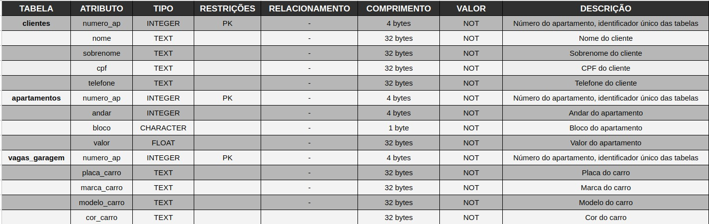
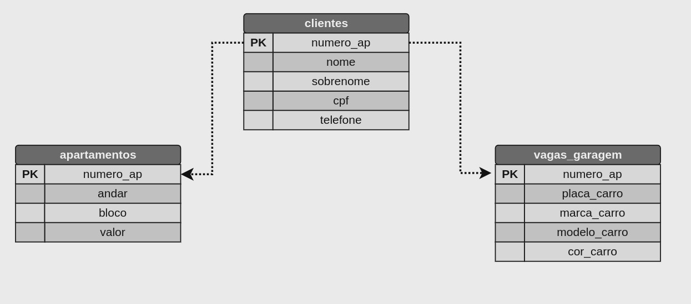

# Projeto Sistema Imobiliário
Projeto desenvolvido na disciplina de Banco de Dados I, lecionada pelo professor Samuel Macedo no curso de Tecnologia em Análise e Desenvolvimento de Sistemas pelo IFPE.
O projeto é baseado em uma abstração de um sistema imobiliário, onde o usuário poderá cadastrar um novo cliente, que possui um apartamento e uma vaga na garagem.

## Operações

- **Criar Database:** Cria um novo banco de dados para armazenar as informações do usuário.
- **Criar Tabela:** Cria uma tabela no banco de dados para armazenar as informações do usuário.
- **Inserir Dados:** Adiciona novos registros à tabela.
- **Listar Dados:** Retorna os registros armazenados de acordo com o número do apartamento.
- **Listar Todos os Dados:** Retorna todos os registros armazenados no banco de dados.
- **Deletar Dados:** Remove os registros de um usuário com base no número do apartamento.
- **JOIN entre Tabelas:** Realiza operações JOIN entre diferentes tabelas para combinar informações.
- **Exportar para Excel:** Cria um arquivo .xsls com todas as informações contidas no banco de dados.

## Dicionário de dados

## Diagrama de Relacionamento

